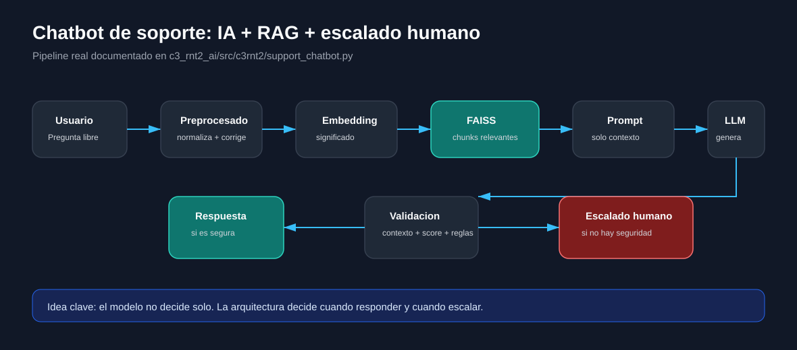
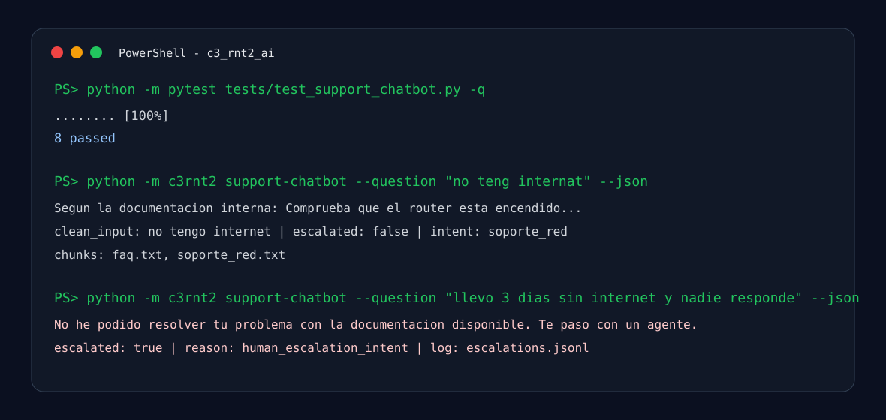
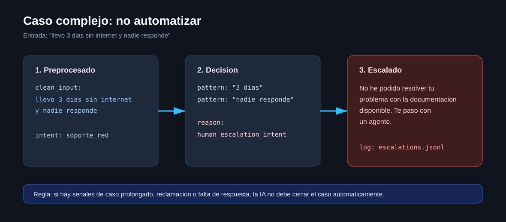
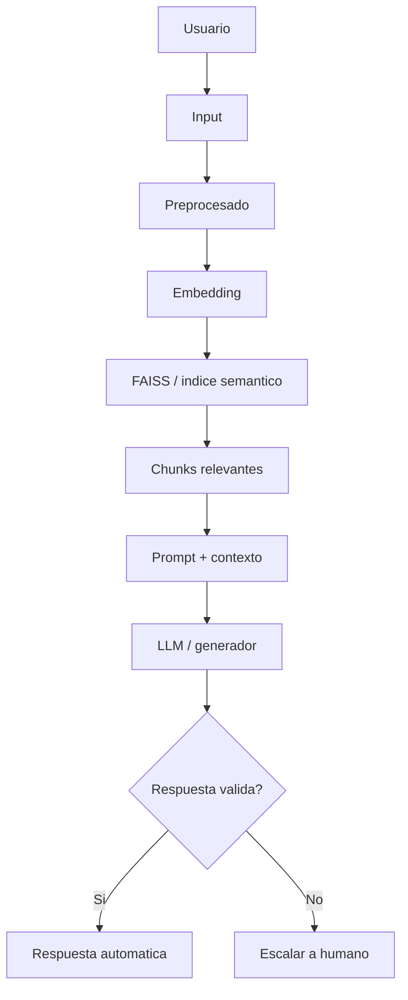
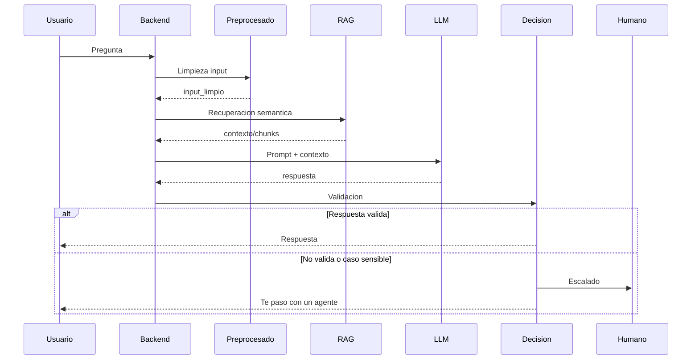

# Chatbot de atencion al cliente con IA + RAG + escalado a humano

Proyecto final de chatbot de soporte tecnico integrado en Vortex. El sistema responde preguntas frecuentes, usa documentacion interna mediante RAG, limpia entradas con errores, valida si la respuesta es segura y escala a una persona cuando el caso no debe automatizarse.

Esta entrega no anade coste de rendimiento al runtime: el README y las capturas son documentacion estatica. La ejecucion real sigue en el backend existente.

## Capturas







## 1. Objetivos de la practica

El proyecto cumple los objetivos pedidos:

| Objetivo | Implementacion |
| --- | --- |
| Disenar un sistema completo de atencion al cliente | Pipeline completo en [`support_chatbot.py`](c3_rnt2_ai/src/c3rnt2/support_chatbot.py). |
| Integrar preprocesado + RAG semantico + prompting | Preprocesado, recuperacion, prompt y generacion separados por funciones. |
| Decidir cuando una IA debe responder y cuando no | Validacion por contexto, score, longitud, marcadores de incertidumbre e intencion. |
| Implementar escalado a humano | Registro JSONL y respuesta de traspaso en `escalar_a_humano`. |
| Analizar comportamiento en casos reales | Tests de FAQ, errores, contexto ausente y casos complejos en [`test_support_chatbot.py`](c3_rnt2_ai/tests/test_support_chatbot.py). |

## 2. Idea general

El chatbot recibe una pregunta, normaliza el texto, recupera fragmentos relevantes de documentacion interna, construye un prompt limitado al contexto, genera una respuesta y decide si puede entregarla o si debe escalar.



## 3. Arquitectura del sistema

| Componente | Funcion | Codigo |
| --- | --- | --- |
| Preprocesado | Limpia, normaliza y corrige errores habituales. | [`preprocesar_input`](c3_rnt2_ai/src/c3rnt2/support_chatbot.py) |
| Embedding | Representa significado de pregunta y chunks. | [`KnowledgeStore`](c3_rnt2_ai/src/c3rnt2/continuous/knowledge_store.py) |
| FAISS | Recupera contexto por similitud cuando esta disponible. | [`KnowledgeStore`](c3_rnt2_ai/src/c3rnt2/continuous/knowledge_store.py) |
| Chunks | Fragmentos procedentes de documentos internos. | [`documentos/`](c3_rnt2_ai/documentos) |
| Prompt | Obliga a responder solo con contexto. | [`build_prompt`](c3_rnt2_ai/src/c3rnt2/support_chatbot.py) |
| LLM | Genera respuesta; tiene fallback local para pruebas. | [`generar_respuesta`](c3_rnt2_ai/src/c3rnt2/support_chatbot.py) |
| Decision | Valida calidad, contexto e intencion. | [`es_respuesta_valida`](c3_rnt2_ai/src/c3rnt2/support_chatbot.py) |
| Escalado | Devuelve traspaso y registra el caso. | [`escalar_a_humano`](c3_rnt2_ai/src/c3rnt2/support_chatbot.py) |

Flujo backend:



## 4. Preparacion del sistema

La documentacion interna esta en [`c3_rnt2_ai/documentos`](c3_rnt2_ai/documentos):

```text
documentos/
+-- faq.txt
+-- incidencias.txt
`-- soporte_red.txt
```

Ejemplo real usado por el sistema:

```text
Para reiniciar el router:
1. Desconectar alimentacion.
2. Esperar 30 segundos.
3. Volver a conectar.
4. Esperar 2 minutos.
```

El indice se crea desde esos documentos con [`SupportChatbot.from_documents`](c3_rnt2_ai/src/c3rnt2/support_chatbot.py). `KnowledgeStore` usa `index_backend="auto"`: emplea FAISS si esta instalado y cae a ranking local si el entorno no lo soporta, evitando que el proyecto falle en Windows o CI.

## 5. Implementacion

### 5.1 Preprocesado

La entrada se pasa a minusculas, se eliminan acentos, se compactan espacios y se corrigen errores frecuentes:

```python
def preprocesar_input(texto: str) -> str:
    cleaned = _strip_accents(str(texto or "").lower())
    cleaned = " ".join(cleaned.split())
    for wrong, right in TYPO_FIXES.items():
        cleaned = re.sub(rf"\b{re.escape(wrong)}\b", right, cleaned)
    return cleaned
```

Casos cubiertos:

| Entrada | Salida |
| --- | --- |
| `No teng internat` | `no tengo internet` |
| `el ruter no funksiona` | `el router no funciona` |

### 5.2 Recuperacion RAG

El sistema recupera chunks relevantes con embedding y ranking:

```python
chunks = bot.recuperar_chunks(input_limpio)
```

La recuperacion combina similitud semantica y solapamiento lexical para mejorar preguntas cortas o con faltas.

### 5.3 Prompt

El prompt fuerza el comportamiento de soporte:

```text
Responde como agente de soporte tecnico.
Usa SOLO la informacion del contexto.
Si no puedes responder con seguridad, indica que escalaras el caso.
```

Esto reduce respuestas inventadas: si el contexto no basta, la decision final escala.

### 5.4 Generacion

La generacion acepta un LLM real cuando el backend lo proporciona. En pruebas puede usar fallback determinista basado en el primer chunk, lo que permite validar RAG, decision y escalado sin depender de GPU ni red.

Endpoint API:

```http
POST /v1/support-chatbot/ask
```

Codigo: [`server.py`](c3_rnt2_ai/src/c3rnt2/server.py).

### 5.5 Logica de decision

La respuesta se rechaza si:

| Regla | Motivo |
| --- | --- |
| No hay contexto | El sistema no tiene base documental. |
| Score bajo | El chunk no es suficientemente relevante. |
| Respuesta insegura | Contiene frases como `no tengo informacion`. |
| Respuesta demasiado corta | Probable salida inutil. |
| Intencion sensible | Caso de varios dias, reclamacion, nadie responde, compensacion, baja. |

Codigo: [`es_respuesta_valida`](c3_rnt2_ai/src/c3rnt2/support_chatbot.py) y [`requiere_humano`](c3_rnt2_ai/src/c3rnt2/support_chatbot.py).

### 5.6 Escalado

Si no puede responder con seguridad:

```text
No he podido resolver tu problema con la documentacion disponible. Te paso con un agente.
```

Ademas registra el caso en:

```text
data/support_chatbot/escalations.jsonl
```

Campos registrados:

```json
{
  "ts": 1779120000.0,
  "question": "llevo 3 dias sin internet y nadie responde",
  "clean_input": "llevo 3 dias sin internet y nadie responde",
  "reason": "human_escalation_intent"
}
```

### 5.7 Pipeline completo

```python
def manejar_pregunta(pregunta):
    limpio = preprocesar_input(pregunta)
    contexto = recuperar_chunks(limpio)
    respuesta = generar_respuesta(contexto, limpio)

    if not es_respuesta_valida(respuesta, contexto):
        return escalar_a_humano(pregunta)

    return respuesta
```

La version real tambien detecta intencion, muestra chunks, anade motivo de decision y escribe logs de escalado.

## 6. Actividad guiada

| Actividad | Prueba | Resultado esperado |
| --- | --- | --- |
| Caso base | `Como reinicio el router?` | Responde con pasos del router. |
| Errores en input | `no teng internat` | Corrige a `no tengo internet` y responde. |
| Errores en input | `el ruter no funksiona` | Corrige a `el router no funciona` y recupera soporte de red. |
| Caso complejo | `llevo 3 dias sin internet y nadie responde` | Escala a humano. |
| Forzar fallo | Quitar docs relevantes | Escala por contexto ausente. |
| Ajustar reglas | Cambiar validacion | Aumenta o reduce automatizacion. |

## 7. Que debes observar

Tecnico:

- El modelo puede ser el mismo.
- El indice puede ser el mismo.
- La calidad cambia por arquitectura: preprocesado, recuperacion, prompt y decision.

Conceptual:

- La inteligencia del sistema no esta solo en el LLM.
- La parte critica es decidir cuando no responder.
- Un chatbot sin escalado tiende a inventar, cerrar casos mal o automatizar problemas que necesitan una persona.

## 8. Problemas reales cubiertos

| Problema | Mitigacion |
| --- | --- |
| Respuestas inventadas | Prompt con contexto obligatorio + validacion. |
| Mala validacion | Reglas por contexto, score, longitud e incertidumbre. |
| Sobreautomatizacion | Patrones de escalado humano. |
| Errores de escritura | Normalizacion y diccionario de errores. |
| Falta de trazabilidad | Chunks devueltos y logs JSONL de escalado. |

## 9. Preguntas de reflexion

**Donde esta la inteligencia del sistema?**
En la arquitectura completa: limpieza, recuperacion, prompt, validacion y escalado. El LLM solo redacta; el sistema decide si debe confiar en esa salida.

**Que parte es mas critica?**
La logica de decision. Un buen RAG pierde valor si el sistema acepta respuestas sin contexto o no escala casos sensibles.

**Que pasa si no se escala nunca?**
El bot fuerza respuestas aunque no tenga informacion. Eso genera alucinaciones, mala experiencia y riesgo operativo.

**Que errores no puede resolver la IA?**
No puede resolver falta de documentacion, averias reales no registradas, decisiones contractuales, identidad no verificada, reclamaciones legales o casos repetidos que requieren intervencion humana.

## 10. Reto final

El reto final esta implementado:

| Reto | Estado | Codigo |
| --- | --- | --- |
| Deteccion de intencion | Hecho: `soporte_red`, `facturacion`, `incidencia`, `general`. | [`detectar_intencion`](c3_rnt2_ai/src/c3rnt2/support_chatbot.py) |
| Mostrar chunks | Hecho: respuesta incluye `chunks`. | [`SupportChatbotResult`](c3_rnt2_ai/src/c3rnt2/support_chatbot.py) |
| Logging de escalados | Hecho: JSONL con pregunta, input limpio y motivo. | [`escalar_a_humano`](c3_rnt2_ai/src/c3rnt2/support_chatbot.py) |

## 11. Pruebas

Ejecutar tests especificos:

```bash
cd c3_rnt2_ai
python -m pytest tests/test_support_chatbot.py -q
```

Ejecutar por CLI:

```bash
python -m c3rnt2 support-chatbot --question "no teng internat" --json
python -m c3rnt2 support-chatbot --question "llevo 3 dias sin internet y nadie responde" --json
```

Si el paquete esta instalado, tambien se puede usar el script `vortex support-chatbot`.

Ejecutar por API:

```bash
curl -X POST http://localhost:8000/v1/support-chatbot/ask \
  -H "Content-Type: application/json" \
  -d "{\"question\":\"no teng internat\",\"use_llm\":false}"
```

Salida esperada para errores en input:

```json
{
  "clean_input": "no tengo internet",
  "escalated": false,
  "intent": "soporte_red",
  "reason": "answered",
  "chunks": [
    {
      "source": "faq.txt",
      "score": 1.0
    }
  ]
}
```

Salida esperada para caso complejo:

```json
{
  "clean_input": "llevo 3 dias sin internet y nadie responde",
  "escalated": true,
  "intent": "soporte_red",
  "reason": "human_escalation_intent",
  "answer": "No he podido resolver tu problema con la documentacion disponible. Te paso con un agente."
}
```

## Entrega y evaluacion

| Criterio | Peso | Evidencia |
| --- | ---: | --- |
| Arquitectura | 30% | Flujo completo, diagramas, endpoint y pipeline. |
| Preprocesado | 15% | Correccion de faltas y normalizacion. |
| RAG | 20% | Documentos internos, chunks, indice semantico. |
| Decision | 25% | Validacion, patrones de humano, logs. |
| Analisis | 10% | Reflexion, problemas reales y pruebas guiadas. |

## Mapa de codigo

| Archivo | Proposito |
| --- | --- |
| [`c3_rnt2_ai/src/c3rnt2/support_chatbot.py`](c3_rnt2_ai/src/c3rnt2/support_chatbot.py) | Pipeline principal del chatbot. |
| [`c3_rnt2_ai/src/c3rnt2/server.py`](c3_rnt2_ai/src/c3rnt2/server.py) | Endpoint HTTP `/v1/support-chatbot/ask`. |
| [`c3_rnt2_ai/src/c3rnt2/__main__.py`](c3_rnt2_ai/src/c3rnt2/__main__.py) | Comando CLI `support-chatbot`. |
| [`c3_rnt2_ai/src/c3rnt2/continuous/knowledge_store.py`](c3_rnt2_ai/src/c3rnt2/continuous/knowledge_store.py) | Embeddings, ranking y FAISS/fallback. |
| [`c3_rnt2_ai/documentos/faq.txt`](c3_rnt2_ai/documentos/faq.txt) | Preguntas frecuentes. |
| [`c3_rnt2_ai/documentos/incidencias.txt`](c3_rnt2_ai/documentos/incidencias.txt) | Reglas de incidencias y escalado. |
| [`c3_rnt2_ai/documentos/soporte_red.txt`](c3_rnt2_ai/documentos/soporte_red.txt) | Procedimientos de red. |
| [`c3_rnt2_ai/tests/test_support_chatbot.py`](c3_rnt2_ai/tests/test_support_chatbot.py) | Pruebas automatizadas del proyecto. |
